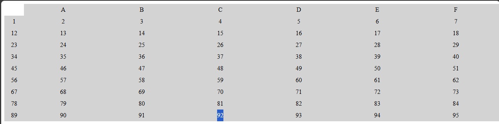

# 🧠 3D - Learn Functional Programming by Building a Spreadsheet
* Functional programming is a popular approach to software development where code is organised into smaller functions which are combined to building complex programs
* In this spreadsheet application project, I will learn about parsing and evaluating mathematical expressions, implement spreadsheet functions, handling cell references and dynamically updating the page based on user input
* I will cover convepts like `map()`, `find()`, `includes()`, and `parseInt()`
* In JavaScript, unused parameters are prefixed with `_` as common convention

## 👨‍🍳 Final Product 👨‍🍳
* You can try out the application I built in this tutorial via this [link](https://htmlpreview.github.io/?https://github.com/shivkumar98/FreeCodeCamp-Projects/blob/main/05-javascript-a-ds-new/3-functional-programming/3d-learn-functional-programming-building-spreadsheet/code/index.html)


## 📝 Summary Notes  📝
* The `window` object represent the browser window, you can define behaviour of the window when the HTML, CSS and scripts have finished loading using the `.onload` property
* You can define nested functions which enables the function to reuse logic without having the logic globally defined:
   ```js
   const outer = () => {
      const inner = () => { }
   }
   ```
* You can covert a letter to the numeric unicode representation using `.charCodeAt()` - you can pass an optional parameter to specify the index of the character within a stringcCodeAt(3); // 99
   ```
* You can convert the numeric unicode representation of a character to a string using `String.fromCharCode()`
   ```js
   String.fromCharCode(99); // 'c'
   ```
* You can directly update an attribute using the following syntax, rather than using `.setAttribute()`:
   ```js
   element.attributeNameWithHypens = value
   ```
 * E.g you can set `aria-label` via:
   ```js
   element.ariaLabel = "Aria Label Value";
   ```
* The event from a `change` event listener has a `target` property which represents the DOM element being changed

* The `.replace()` method has signature for a regex and a string, but there is also a signature for a regex and a function. This function is applied to matched characters. E.g.:
   ```js
   const x = "shiv is cool";
   x.replace(/[sio]/, (match)=>match.toUpperCase())
   // returns ShIv Is cOOl
   ```


## 🟥 1. Project Setup 🛠️

* I have been provided the [HTML](code/index.html) and [CSS](code/styles.css)

## 🟥 2. Programtically Generate Cells
* I have been supplied with a HTML container and some CSS. My first task is to programtically generate cells for your spreadsheet
* The global `window`  represents the browser window. It has `.onload` property which lets you define functionality when the window has loaded the entire page, including CSS and scripts.
* I set the onload property of window to a function which obtains the `#container` div:
   ```js
   window.onload = () => {
      const container = document.getElementById("container");
   }
   ```

   ### 🟡 **2.1 Nested Functions**
* Nested functed functions allow a function to reuse logic.
* I create a nested function to create a label:
   ```js
   window.onload = () => {
      const container = document.getElementById("container");
      const createLabel = (name) => {
         
      }
   }
   ```
* I implement the `crateLabel` function using the `createElement()`, adn `appendChild()` methods to add element to the `#container`:
   ```js
   const createLabel = (name) => {
      const label = document.createElement("div");
      label.className = "label";
      label.textContent = name;
      container.appendChild(label);
   }
   ```

   ### 🟡 **2.2 Creating Range Function**
* I need to create a function which will create an array of numbers ranging from a starting value and ending value
* I initialise my `range` function by returning an array:
   ```js
   const range = (start, end) => Array();
   ```
* If I need to create a range from 1-3, the number of elements will be `end`-`start`+1 = 3. 
* I need intiialise my array with a lengh, so I use the above logic to do this:
   ```js
   const range = (start, end) => Array(end - start + 1);
   ```
* I chain the `fill()` method to the constructor, and fill the array with the `start` parameter:
   ```js
   const range = (start, end) => Array(end - start + 1)
      .fill(start);
   ```
* I need to map each element such that each element is incremented by the index, so if I have a range of 1-3 => `[1+0, 1+1, 1+2]`
* I can achieve this via the `map()` method:
   ```js
   const range = (start, end) => Array(end - start + 1)
      .fill(start)
      .map((element, index) => element + index);
   ```

   ### 🟡 **2.3 Creating Character Range Function**
* I also need a function which will create a range of characters, e.g. `a-c` => `[a,b,c]`
* I declare a `charRange` function:
   ```js
   const charRange = (start, end) => range(start, end)
   ```
* I cannot use the `range()` function like this, since it needs to be passed a number (due to calculation of array length)
* I fix this by converting the parameters to numbers using `.charCodeAt(0)` (0 is an optional parameter which declares the index):
   ```js
   const charRange = (start, end) => 
      range(start.charCodeAt(0), end.charCodeAt(0));
   ```
* Now I have an array with a range of numbers representing the letters, I can covert these back to letters using `String.fromCharCode()`:
   ```js
   const charRange = (start, end) => 
      range(start.charCodeAt(0), end.charCodeAt(0))
         .map(code=>String.fromCharCode(code));
   ```

   ### 🟡 **2.4 Displaying Columns A-J**
* My two helper functions are complete, I can go back to the `onload` event handler
* I create a variable to store letters A to J, and call the `createLabel()` function on each letter:
   ```js
   window.onload = () => {
      const container = document.getElementById("container");
      const createLabel = (name) => {
         const label = document.createElement("div");
         label.className = "label";
         label.textContent = name;
         container.appendChild(label);
      }
      const letters = charRange("A", "J")
      letters.forEach(createLabel)
   }
   ```
* Now I have the columns showing on page load:
   <details>
      <summary>Screenshot</summary>

   
   </details>

   ### 🟡 **2.5 Displaying Rows 1-99 and Input Cells**
* I create a range 1-99, and create a label for each element:
   ```js
   window.onload = () => {
      // EXISTING CODE
      range(1,99).forEach(number => {
         createLabel(number)
      })
   }
   ```
* This renders the labels as columns rather than rows:
   
   

* I nest a `forEach()` loop on the `letters` array, to create a new input in the DOM (for the cells):
   ```js
   range(1, 99).forEach(number => {
      createLabel(number);
      letters.forEach(letter => {
      const input = document.createElement("input");
      input.type = "text";
      input.id = letter + number;
      })
   })
   ```

   
   #### 💡 **Setting Attributes** 💡
* In earlier projects, I set the attribute of an element using `.setAttribute()` 
* You can directly update an attribute using the following syntax, rather than using `.setAttribute()`:
   ```js
   element.attributeNameWithHypens = value
   ```
 * E.g you can set `aria-label` via:
   ```js
   element.ariaLabel = "Aria Label Value";
   ```

* I set the `aria-label` to `letter + number` as well:

   ```js
   letters.forEach(letter => {
      const input = document.createElement("input");
      input.type = "text";
      input.id = letter + number;
      input.ariaLabel = letter + number;
   })
   ```
* Finally to get the cells on the page, I append the input to the container element as a child:
   ```js
   letters.forEach(letter => {
      const input = document.createElement("input");
      input.type = "text";
      input.id = letter + number;
      input.ariaLabel = letter + number;
      container.appendChild(input)
   })
   ```
* Here is what the spreadsheet looks like now:

   

* Here is the full code which is used to load the webpage:

   <details>

   ```js
   window.onload = () => {
      const container = document.getElementById("container");
      const createLabel = (name) => {
         const label = document.createElement("div");
         label.className = "label";
         label.textContent = name;
         container.appendChild(label);
      }
      const letters = charRange("A", "J")
      letters.forEach(createLabel)
      range(1, 99).forEach(number => {
         createLabel(number);
         letters.forEach(letter => {
            const input = document.createElement("input");
            input.type = "text";
            input.id = letter + number;
            input.ariaLabel = letter + number;
            container.appendChild(input)
         })
      })
   }
   ```
   </details>

## 🟥 3. Programming functions
* I am now going to start programming the built in functions that can be utilised by my spreadsheet
* I create a `sum()` function sums values of an array parameter:
   ```js
   const sum = (nums) => nums.reduce((el, acc)=>el+acc,0)
   ```
* I create an isEven function which checks if a number is even or not:
   ```js
   const isEven = (num) => num % 2 === 0
   ```
* I create a function which finds the average of an array:
   ```js
   const average = (nums) => sum(nums)/nums.length
   ```
* I create a function to calculate the media of an array of numbers:
   ```js
   const median = nums => {
      const sorted = nums.slice().sort((a, b) => a - b);
      const length = sorted.length;
      const middle = length / 2 - 1;
      return isEven(middle) ? average(sorted[middle], sorted[middle+1]) : sorted[Math.floor(middle)+1]
   }
   ```

* I decalre a `spreadsheetFunctions` object which maps all the above functions themselves. I use shorthand notation syntax to do this:
   ```js
   const spreadsheetFunctions = {
      sum,
      average,
      median
   }
   ```

## 🟥 4. Detecting User entering Expression in Cell
* I shall now start utilising these functions
* I create an update function which takes an event parameter, I add a console log for debugging:
   ```js
   const update = event => {
      console.log("change");
   }
   ```
* I want to trigger the above function when the input is modified. So on the `window.onload` function I call the function on change of input:
   ```js
   window.onload = () => {
      // EXISTING CODE HERE
      range(1, 99).forEach(number => {
         createLabel(number);
         letters.forEach(letter => {
            const input = document.createElement("input");
            input.type = "text";
            input.id = letter + number;
            input.ariaLabel = letter + number;
            input.onchange = update
            // REST OF CODE HERE
         })
      })
   }
   ```
* Now when I enter text, and press enter on any of the cells the `update()` function is triggered
* The event from a `change` event listener has a `target` property which represents the DOM element being changed💡
* I assign the target property to a constant called `element`:
   ```js
   const update = event => {
      const element = event.target
   }
   ```
* I can obtain the value of the element after its been changed using the `.change` property. I assign this to variable called value and remove the whitespace:
   ```js
   const update = event => {
      const element = event.target;
      const value = element.value.replace(/\s/g,"")
   }
   ```
* I check that the value does not include the ID of the element. I only want to update the cell if the user types "=" at the beginning of the expression so I write an if statement for both of these:
   ```js
   const update = event => {
      const element = event.target;
      const value = element.value.replace(/\s/g, "");
      if (!value.includes(element.id) && value[0]==="=") {
         
      }
   }
   ```

## 🟥 5. Evaluating Formaulas
* I will now create a function which can parse and evaluate the input string. I dfeclare an `evalFormula` function which takes `x` and `cells` as parameters:
   ```js
   const evalFormula = (x, cells) => {
   }
   ```
* Within this function, I declare `idToText` function which takes an `id` parameter which finds the cell where the ID match:
   ```js
   const evalFormula = (x, cells) => {
      idToText = (id) => cells.find(cell=>cell.id === id).value
   }
   ```
* I need to be ablet to match cell ranges in a formula (like `A1:B12`, `A3:A25`) - I will use regex to match these patterns
* I declare a `rangeRegex` to match `A` to `J`. I will use a character class to achieve this:
   ```js
   const evalFormula = (x, cells) => {
      idToText = (id) => cells.find(cell=>cell.id === id).value
      const rangeRegex = /([A-J])/
   }
   ```
* After getting a matching cell leeter, the regex needs to martch a number from 1-99, I add a second capture group for this to capture a digit and an optional second digit:
   ```js
   const rangeRegex = /([A-J])([1-9][0-9]?)/;
   ```
* I then need to match for a colon after first two capture letters:
   ```js
   const rangeRegex = /([A-J])([1-9][0-9]?):/;
   ```
* I can copy and paster my first two capture groups after the colon:
   ```js
   const rangeRegex = /([A-J])([1-9][0-9]?):([A-J])([1-9][0-9]?)/;
   ```
* Finally i make it global and case insentitve:
   ```js
   const rangeRegex = /([A-J])([1-9][0-9]?):([A-J])([1-9][0-9]?)/ig;
   ```

<br>

* I then create a `rangeFromString()` function which makes a range of numbers between two numbers, I parse it to make it safe to call the range on it:
   ```js
   const evalFormula = (x, cells) => {
      const idToText = id => cells.find(cell => cell.id === id).value;
      const rangeRegex = /([A-J])([1-9][0-9]?):([A-J])([1-9][0-9]?)/ig;
      const rangeFromString = (num1, num2) => range(parseInt(num1), parseInt(num2));
   }
   ```
* I declare a `elemValue()` function which returns a function:
   ```js
   const evalFormula = (x, cells) => {
      // EXISTING CODE HERE
      const elemValue = num => {
         const inner = character => {
            return idToText(character + num);
         }
         return inner;
      }
   }
   ```
* I create a curried function called `addCharacters()` which takes a `character1` parameter which returns a function which takes `character2` parameter:
   ```js
   const evalFormula = (x, cells) => {
      // EXISTING CODE HERE
      const elemValue = num => {
         const inner = character => {
            return idToText(character + num);
         }
         return inner;
      }
      const addCharacters = character1 => character2 => {
      }
   }
   ```
* I return another function which takes a `num` parameter:
   ```js
   const addCharacters = character1 => character2 => num => {}
   ```
* I refactor my `elemValue` to use currying:
   ```js
   const elemValue = num => character => idToText(character + num);
   ```
* I chain the `.map()` method to the `charRange()` call for the `addCharacters()`:
   ```js
   const evalFormula = (x, cells) => {
   // EXISTING CODE HERE
   const addCharacters = character1 => character2 => num => charRange(character1, character2).map(elemValue(num));
   }
   ```
* I declare a `rangeExpanded` variable:
   ```js
   const evalFormula = (x, cells) => {
   // EXISTING CODE HERE
   const rangeExpanded = x.replace(rangeRegex);
   }
   ```
* The `.replace()` method has signature for a regex and a string, but there is also a signature for a regex and a function. This function is applied to matched characters. E.g.:
   ```js
   const x = "shiv is cool";
   x.replace(/[sio]/, (match)=>match.toUpperCase())
   // returns ShIv Is cOOl
   ```
* I add the function to the `.replace()` method:
   ```js
   const rangeExpanded = x.replace(rangeRegex, (match)=>{});
   ```
* The `rangeRegex` has four capture groups, these four capture groups can be matched by the function in the `.replace()` call - I declare the match parameter as well as the two character and two number capture groups:
   ```js
   const rangeExpanded = x.replace(rangeRegex, (match, char1, num1, char2, num2) => {});
   ```
* I implicitly return a call to `rangeFromString()`:
   ```js
   const rangeExpanded = x.replace(rangeRegex, (match, char1, num1, char2, num2) => rangeFromString(num1, num2));
   ```
* I chain on a call to the `addCharacters()` function:
   ```js
   const rangeExpanded = x.replace(rangeRegex, (match, char1, num1, char2, num2) => rangeFromString(num1, num2).map(addCharacters));
   ```
* Since addCharacters() returns a function which returns a function, I pass in `char1` and `char2`:
   ```js
   const rangeExpanded = x.replace(rangeRegex, (match, char1, num1, char2, num2) => rangeFromString(num1, num2).map(addCharacters(char1)(char2)));
   ```
* In JavaScript, unused parameters are prefixed with `_` as common convention
* I denote the `match` parameter as bein unused:
   ```js
   const rangeExpanded = x.replace(rangeRegex, (_match, char1, num1, char2, num2) => rangeFromString(num1, num2).map(addCharacters(char1)(char2)));
   ```
* I declare a `cellRegex` to match cell references:
   ```js
   const cellRegex = /[A-J][1-9][0-9]?/ig
   ```
* I declare a `cellExpanded` variable which calls `.replace()` on `rangeExpanded`:
   ```js
   const cellExpanded = rangeExpanded.replace(cellRegex, (match)=>{})
   ```
* I update the matching function to return `idToText()` with the match being made uppercase:
   ```js
   const cellExpanded = rangeExpanded.replace(cellRegex, match => idToText(match.toUpperCase()))
   ```
* Here is the implementation of `evalFormula()`:
   ```js
   const evalFormula = (x, cells) => {
      const idToText = id => cells.find(cell => cell.id === id).value;
      const rangeRegex = /([A-J])([1-9][0-9]?):([A-J])([1-9][0-9]?)/ig;
      const rangeFromString = (num1, num2) => range(parseInt(num1), parseInt(num2));
      const elemValue = num => character => idToText(character + num);
      const addCharacters = character1 => character2 => num => charRange(character1, character2).map(elemValue(num));
      const rangeExpanded = x.replace(rangeRegex, (_match, char1, num1, char2, num2) => rangeFromString(num1, num2).map(addCharacters(char1)(char2)));
      const cellRegex = /[A-J][1-9][0-9]?/gi;
      const cellExpanded = rangeExpanded.replace(cellRegex, match => idToText(match.toUpperCase()));
   }
   ```
* An infix is a mathematical operator which appears between two operands
* I create a `infixToFunction` object which can map symbols to functions to be used when parsing expressions:
   ```js
   const infixToFunction = {
   }
   ```
* I map `+` to a function which sums two parameters:
   ```js
   const infixToFunction = {
      "+": (x, y) => x + y,
   }
   ```
* I do the same for `-`, `/` and `*`:
   ```js
   const infixToFunction = {
      "+": (x, y) => x + y,
      "-": (x, y) => x - y,
      "/": (x, y) => x / y,
      "*": (x, y) => x * y
   }
   ```
* I declare an `infixEval()` functions which takes `str` and `regex` parameters:
   ```js
   const infixEval = (str, regex) => str.replace(regex, () => {});
   ```
* I add `match`, `arg1`, `operator` and `arg2` as parameters:
   ```js
   const infixEval = (str, regex) => str.replace(regex, (_match, arg1, operator, arg2) => {});
   ```
* I return the `operator` key's value from `infixToFuntion`:
   ```js
   const infixEval = (str, regex) => str.replace(regex, (_match, arg1, operator, arg2) => infixToFunction[operator]);
   ```
* I now pass `arg1` and `arg2` to the function from the object:
   ```js
   const infixEval = (str, regex) => str.replace(regex, (_match, arg1, operator, arg2) => infixToFunction[operator](arg1, arg2));
   ```
* `arg1` and `arg2` are strings, so the operations will be applied incorrectly. I use `parseFloat()` method to change these to numbers:
   ```js
   const infixEval = (str, regex) => str.replace(regex, (_match, arg1, operator, arg2) => infixToFunction[operator](parseFloat(arg1), parseFloat(arg2)));
   ```
* I create a function to account for order of operations:
   ```js
   const highPrecedence = (str) => {}
   ```
* I check if the `str` matches a number followed by a `*` or `/` followed by another number:
```js
   const highPrecedence = str => {
      const regex = /([\d.]+)([*\/])([\d.]+)/;
      return regex.test(str);
   }
   ```
* I am now going to evaluate the expression, I declare a `str2` variable:
   ```js
   const highPrecedence = str => {
   const regex = /([\d.]+)([*\/])([\d.]+)/;
   const str2 = infixEval(str, regex)
   }
   ```
* The `infixEval()` function will only evaluate the first multiplication or division operation, because `regex` isn't global.
* I check if `str2` is equal to `str` and return `str` otherwise i return `highPrecedence(str2)`:
   ```js
   const highPrecedence = str => {
      const regex = /([\d.]+)([*\/])([\d.]+)/;
      const str2 = infixEval(str, regex);
      return str === str2 ? str : highPrecedence(str2)
   }
   ```
* I will now start applying the function, so I declare a `applyFunction()` which takes a `str` function:
   ```js
   const applyFunction = str => {
   }
   ```
* I declare a `noHigh` variable and assign it to the result of `highPrecedence(str)`:
   ```js
   const applyFunction = str => {
      const noHigh = highPrecedence(str);
   }
   ```
* I declare an `infix` variable which will check for a number (including decimal numbers) is followed by `+`/`-` followed by a number:
   ```js
   const applyFunction = str => {
      const noHigh = highPrecedence(str);
      const infix = /([\d.]+)([+-])([\d.]+)/
   }
   ```
* I declare `str2`:
   ```js
   const applyFunction = str => {
      const noHigh = highPrecedence(str);
      const infix = /([\d.]+)([+-])([\d.]+)/;
      const str2 = infixEval(noHigh, infix)
   }
   ```
* I declare a `functionCall` regex which will match for expressions like `sum(1, 4)`:
   ```js
   const applyFunction = str => {
      const noHigh = highPrecedence(str);
      const infix = /([\d.]+)([+-])([\d.]+)/;
      const str2 = infixEval(noHigh, infix);
      const functionCall = /([a-z0-9]*)\(([0-9., ]*)\)(?!.*\()/i
   }
   ```
* I declare an internal `toNumberList()` function which splits an argument by commas and parses it into numbers:
   ```js
   const applyFunction = str => {
      const noHigh = highPrecedence(str);
      const infix = /([\d.]+)([+-])([\d.]+)/;
      const str2 = infixEval(noHigh, infix);
      const functionCall = /([a-z0-9]*)\(([0-9., ]*)\)(?!.*\()/i;
      const toNumberList = (args) => args.split(",").map(parseFloat)
   }
   ```
* I create an internal `applyFunction()` function which obtains the `sum/average/median` functions, I lowercase the `fn` so it matches the case of the object keys:
   ```js
   const applyFunction = str => {
      const noHigh = highPrecedence(str);
      const infix = /([\d.]+)([+-])([\d.]+)/;
      const str2 = infixEval(noHigh, infix);
      const functionCall = /([a-z0-9]*)\(([0-9., ]*)\)(?!.*\()/i;
      const toNumberList = args => args.split(",").map(parseFloat);
      const apply = (fn, args) => spreadsheetFunctions[fn.toLowerCase()]
   }
   ```
* I update the `apply()` function so it uses the `args` parameter:
   ```js
   const applyFunction = str => {
      const noHigh = highPrecedence(str);
      const infix = /([\d.]+)([+-])([\d.]+)/;
      const str2 = infixEval(noHigh, infix);
      const functionCall = /([a-z0-9]*)\(([0-9., ]*)\)(?!.*\()/i;
      const toNumberList = args => args.split(",").map(parseFloat);
      const apply = (fn, args) => spreadsheetFunctions[fn.toLowerCase()](toNumberList(args));
   }
   ```
* I return the result of calling `.replace()` on `str2`:
   ```js
   const applyFunction = str => {
      // EXISTING CODE HERE
      return str2.replace(functionCall, () => {})
   }
   ```
* I update the callback function to take `match`, `fn` and `args` and return if `fn` is a key in `spreadsheetFunctions` - I do this using the `hasOwnProperty() method:
   ```js
   const applyFunction = str => {
      // EXISTING CODE HERE
      return str2.replace(functionCall, (match, fn, args) => 
         spreadsheetFunctions.hasOwnProperty(fn.toLowerCase()))
   }
   ```
* If the `spreadsheetFunctions` does contain the property, I will return the result of calling `apply` with `fn` and `args`; otherwise return match:
   ```js
   const applyFunction = str => {
      // EXISTING CODE HERE
      return str2.replace(functionCall, (match, fn, args) => 
         spreadsheetFunctions.hasOwnProperty(fn.toLowerCase()) ? apply(fn, args) : match)
   }
   ```
* I shall now utilise the function parser in my `evalFormula`. I declare a `functionExpanded`:
   ```js
   const evalFormula = (x, cells) => {
      // EXISTING CODE HERE
      const cellExpanded = rangeExpanded.replace(cellRegex, match => idToText(match.toUpperCase()));
      const functionExpanded = applyFunction(cellExpanded);
   }
   ```
* I return `functionExpanded` if it is equal to `x`, otherwise I call `evalFormula()` using `functionExpanded`:
   ```js
   const evalFormula = (x, cells) => {
      // EXISTING CODE HERE
      const cellExpanded = rangeExpanded.replace(cellRegex, match => idToText(match.toUpperCase()));
      const functionExpanded = applyFunction(cellExpanded);
      return functionExpanded === x ? functionExpanded : evalFormula(functionExpanded, cells)
   }
   ```
* I update the `update()` function so it can actually evaluate formulas. I call `evalFormula()` with the first character of `value`:
   ```js
   const update = event => {
      const element = event.target;
      const value = element.value.replace(/\s/g, "");
      if (!value.includes(element.id) && value.startsWith('=')) {
         element.value = evalFormula(value.slice(1));
      }
   }
   ```
* I need to pass the cells in the second argument - I obtain this using the `children` property of `#container`:
   ```js
   element.value = evalFormula(value.slice(1), document.getElementById('container').children);
   ```
* The `.children` property returns a Collection, rather than an array. I convert the collection using `Array.from()`:
   ```js
   element.value = evalFormula(value.slice(1), Array.from(document.getElementById("container").children));
   ```

## 🟥 6. Adding More Formulas
* I addd an `even` method which filters for even numbers:
   ```js
   const spreadsheetFunctions = {
   sum,
   average,
   median,
   even: nums => nums.filter(isEven),
   }
   ```
* I also add `firsttwo` and `lasttwo` methods:
   ```js
   const spreadsheetFunctions = {
      sum,
      average,
      median,
      even: nums => nums.filter(isEven),
      firsttwo: nums => nums.slice(0, 2),
      lasttwo: nums => nums.slice(-2),
   }
   ```
* I add `has2` and `increment` method
   ```js
   const spreadsheetFunctions = {
      sum,
      average,
      median,
      even: nums => nums.filter(isEven),
      firsttwo: nums => nums.slice(0, 2),
      lasttwo: nums => nums.slice(-2),
      has2: nums => nums.includes(2),
      increment: nums => nums.map(num => num + 1),
   }
   ```
* I add a `someeven` method:
   ```js
   someeven: nums => nums.some(isEven),
   ```
* I add an `evereven` method:
   ```js
   everyeven: nums => nums.every(isEven),
   ```
* I add a `random` method which generates a random number between the first number up to the sum of the two:
   ```js
   random: ([x, y]) => Math.floor(Math.random() * y + x),
   ```
* I add a `range` method which generates a range from first number up to second number of `nums`:
   ```js
   range: nums => range(...nums),
   ```
* I add a `nodupes` method which returns `nums` with duplicates removed:
   ```js
   nodupes: nums => [...new Set(nums)]
   ```
* Finally I add a blank string method:
   ```js
   "": (el) => el
   ```
* My spreadsheet app is now functional and complete! Here is a demo:

   