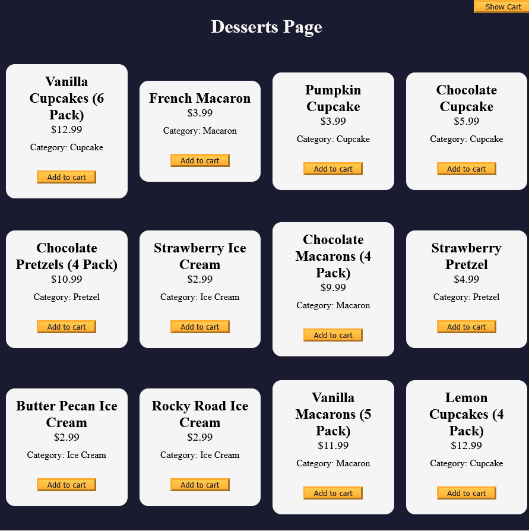
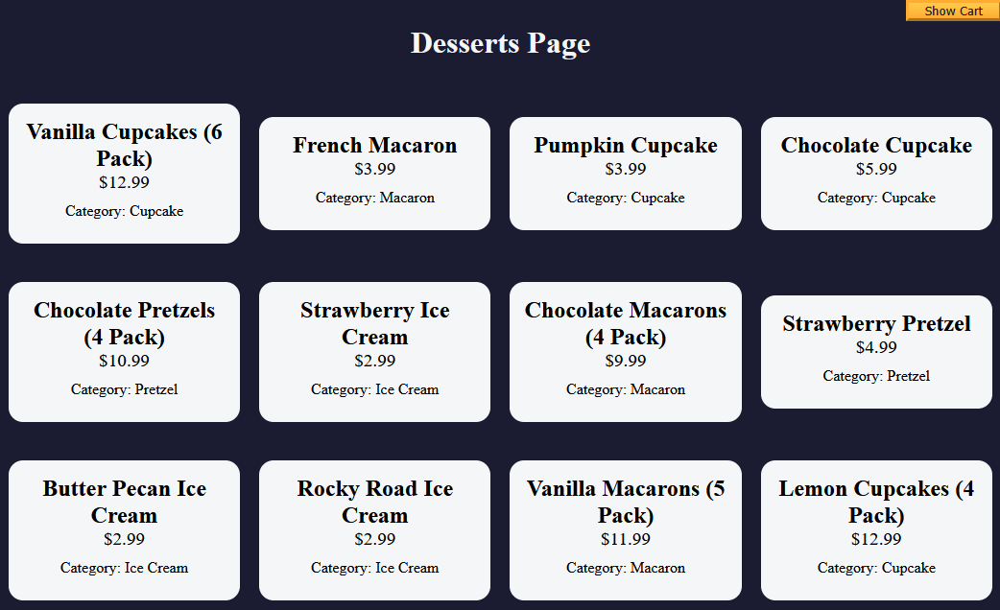
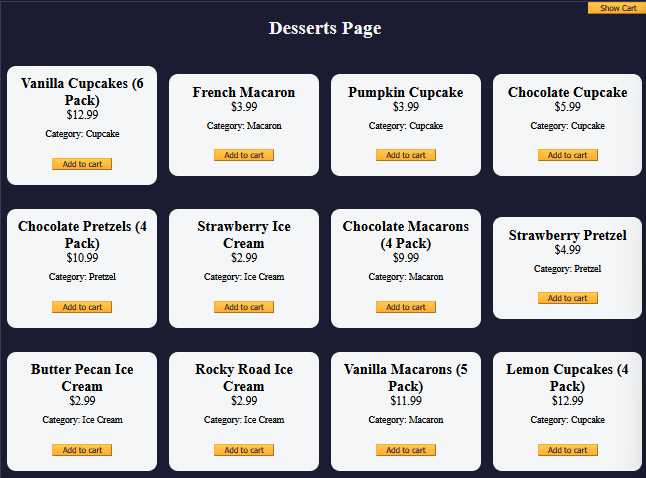

# 🧠 4A Learn Basic OOP by Building a Shopping Cart

* In this project, I will be building a shopping cart application using JavaScript

## 👨‍🍳 Final Product 👨‍🍳

* You can try out the application I built in this tutorial via this [link](https://htmlpreview.github.io/?https://github.com/shivkumar98/FreeCodeCamp-Projects/blob/main/05-javascript-a-ds-new/4-object-oriented-programming/4a-learn-oop-build-shopping-cart/code/index.html)
* Here is a demo:
   
   

## 📝 Summary Notes 📝

* You can create classes in JavaScript in a similar way to Java but using the `class` keyword

   ```js
   class Computer {}
   ```

* A common way to handling null when checking a value is to use `||` operator. You can use this to initialise a value:

   ```js
   const obj = { key: null }
   obj[key] = obj[key] || 0; // sets value of key to 0
   ```

* Browser's have a built-in confirmation dialog, this is displayed in browser using the `confirm()` function which returns true if user confirms and false if the user cancels

<hr>

## 🛠️ Project Setup 🛠️

* I have been provided the [HTML](code/index.html) and [CSS](code/styles.css)
* This is what the page looks like:

   <details>

   
   </details>

## 🟥 Initialising Variables

* I initialise my JavaScript with three variables pointed to the containers:

   ```js
   const cartContainer = document.getElementById("cart-container")
   const productsContainer = document.getElementById("products-container")
   const dessertCards = document.getElementById("dessert-card-container")
   ```

* I intialise variable for buttons:
   ```js
   const cartBtn = document.getElementById("cart-btn");
   const clearCartBtn = document.getElementById("clear-cart-btn");
   ```
   
* I create variables for the total items, subtotal, taxes and total:
  
   ```js
   const totalNumberOfItems = document.getElementById("total-items");
   const cartSubTotal = document.getElementById("subtotal");
   const cartTaxes = document.getElementById("taxes");
   const cartTotal = document.getElementById("total");
   ```

* I create a variable for the `#show-hide-cart` element:

   ```js
   const showHideCartSpan = document.getElementById("show-hide-cart");
   ```

* I create a variable to store whether cart is showing or not, I initialise it to false:

   ```js
   let isCartShowing = false
   ```

## 🟥 Rendering Products

* I intiialise a `products` array with objects with keys: `id`, `name`, `price` and `category`:

   <details>

   ```js
   const products = [
      {
         id: 1,
         name: "Vanilla Cupcakes (6 Pack)",
         price: 12.99,
         category: "Cupcake",
      },
      {
         id: 2,
         name: "French Macaron",
         price: 3.99,
         category: "Macaron",
      },
      {
         id: 3,
         name: "Pumpkin Cupcake",
         price: 3.99,
         category: "Cupcake",
      },
      {
         id: 4,
         name: "Chocolate Cupcake",
         price: 5.99,
         category: "Cupcake",
      },
      {
         id: 5,
         name: "Chocolate Pretzels (4 Pack)",
         price: 10.99,
         category: "Pretzel",
      },
      {
         id: 6,
         name: "Strawberry Ice Cream",
         price: 2.99,
         category: "Ice Cream",
      },
      {
         id: 7,
         name: "Chocolate Macarons (4 Pack)",
         price: 9.99,
         category: "Macaron",
      },
      {
         id: 8,
         name: "Strawberry Pretzel",
         price: 4.99,
         category: "Pretzel",
      },
      {
         id: 9,
         name: "Butter Pecan Ice Cream",
         price: 2.99,
         category: "Ice Cream",
      },
      {
         id: 10,
         name: "Rocky Road Ice Cream",
         price: 2.99,
         category: "Ice Cream",
      },
      {
         id: 11,
         name: "Vanilla Macarons (5 Pack)",
         price: 11.99,
         category: "Macaron",
      },
      {
         id: 12,
         name: "Lemon Cupcakes (4 Pack)",
         price: 12.99,
         category: "Cupcake",
      },
   ];
   ```

   </details>

* I will now use JavaScript to display the products in the HTML. I use a for each loop, and object destructuring for the parameter of the forEach:

   ```js
   products.forEach(
   ({ name, id, price, category }) => {

   }
   );
   ```

* I append a `<div>` element which has a `<h2>` of the `name` of the product to the innerHTML of `dessertCards`:

   ```js
   products.forEach(
      ({ name, id, price, category }) => {
         dessertCards.innerHTML += `
            <div class="dessert-card"><h2>${name}</h2></div>
         `;
      }
   );
   ```

* I add two `<p>` elements after the div to render the price and category:

   ```js
   products.forEach(
   ({ name, id, price, category }) => {
      dessertCards.innerHTML += `
         <div class="dessert-card">
         <h2>${name}</h2>
         <p class="dessert-price">\$${price}</p>
         <p class="product-category">Category: ${category}</p>
         </div>
      `;
   }
   );
   ```

* This is what the dessert page looks like right now:

   

* I add a `Add to cart` button after the second `<p>` element:

   ```js
   products.forEach(
   ({ name, id, price, category }) => {
      dessertCards.innerHTML += `
         <div class="dessert-card">
         <h2>${name}</h2>
         <p class="dessert-price">\$${price}</p>
         <p class="product-category">Category: ${category}</p>
         <button id="${id}" class="add-to-cart-btn">Add to cart</button>
         </div>
      `;
   }
   );
   ```

* This is what the page looks like right now:


   


## 🟥 JavaScript Class

* You can create classes in JavaScript in a similar way to Java but using the `class` keyword

   ```js
   class Computer {}
   ```

* I create a class to represent my shopping cart:
* 
   ```js
   class ShoppingCart {

   };
   ```

* Classes have a special method for constructing the class called `constructor` - this is used to initialise variables.
* I add an empty constructor method to my `ShoppingCart`:

   ```js
   class ShoppingCart {
      constructor() {}
   };
   ```

* Within the constructor, you can use the `this` keyword to set the values of the fields of an object. I intialise the `total` to zero and `taxRate` to 8.25:

   ```js
   class ShoppingCart {
      constructor() {
         this.items = []
         this.total = 0;
         this.taxRate = 8.25
      }
   };
   ```

* I add an `addItem()` method to my class:

   ```js
   class ShoppingCart {
      // constructor

      addItem(id, products) {

      }
   }
   ```

* I use the `id` parameter, to find the product with matching id in the products array:

   ```js
   addItem(id, products) {
      const product = products.find((item) => item.id === id);
   }
   ```

* I destructure the `name` and `price` properties:

   ```js
   addItem(id, products) {
      const product = products.find((item) => item.id === id);
      const {name, price} = product
   }
   ```

* I add the `product` to the `items` field of the ShoppingCart class:
   
   ```js
   addItem(id, products) {
      const product = products.find((item) => item.id === id);
      const { name, price } = product;
      this.items.push(product)
   }
   ```

* I need to have a count of each product in my cart, so I intiialise a counter object and loop through the `items` of my array:
   
   ```js
   addItem(id, products) {
      const product = products.find((item) => item.id === id);
      const { name, price } = product;
      this.items.push(product);

      const totalCountPerProduct = {};
      this.items.forEach((dessert) => {
      
      })
   }
   ```


// TODO: WRITE A SUMMARY NOTE ON THIS
## 🟥 Using OR Operator to Initialise Value 

* In my `totalCountPerProduct` variable, I want to store the `id` of the dessert as the key, and the count as the value
* If totalCountPerProduct doesn't have the id of the dessert already stored, I want to initialise the count as 0
* A common way to address this issue is to use the `||` operator, in my forEach loop I apply this pattern:
   
   ```js
   this.items.forEach((dessert) => {
      totalCountPerProduct[dessert.id] = totalCountPerProduct[dessert.id] || 0
   })
   ```

* I want to the value to be incremented by 1 when a dessert.id is looped, so I increment the RHS by 1:
   
   ```js
   this.items.forEach((dessert) => {
      totalCountPerProduct[dessert.id] = (totalCountPerProduct[dessert.id] || 0) + 1;
   })
   ```

## 🟥 Updating the Cart's Count of Products

* I need to update the count in the frontend, the HTML for this does not exist yet, but when it is there will be a span with an id of `product-count-for-id${product.id}` for each product in cart
* I declare a variable to store the updated count of the product of the item being added, and one for the span for the count in the UI:
   
   ```js
   addItem(id, products) {
      // EXISTING CODE HERE
      const currentProductCount = totalCountPerProduct[product.id];
      const currentProductCountSpan = document.getElementById(`product-count-for-id${product.id}`)
   }
   ```


* If the product is already in the cart, i.e. it's count is more than one, then I need to update the textContent to the count of the product being added followed by an x:
   
   ```js
   currentProductCount > 1 
      ? currentProductCountSpan.textContent = `${currentProductCount}x`
      : undefined;
   ```

* If the product is a new item for the cart (the count will be one), then I need to add a new element to the `productsContainer`, so this code is what generate the intial HTML which is updated when a product is added for a succeeding time:
   
   ```js
   currentProductCount > 1 
      ? currentProductCountSpan.textContent = `${currentProductCount}x`
      : productsContainer.innerHTML += `
         <div id="dessert${id}" class="product">
            <p>
               <span class="product-count" id="product-count-for-id${id}"></span>${name}
            </p>
            <p>${price}</p>
         </div>
      `;
   ```


* The complete implementation of `addItem()` is finished:

   <details>
      <summary>addItem() Implementation</summary>

   ```js
   addItem(id, products) {
      const product = products.find((item) => item.id === id);
      const { name, price } = product;
      this.items.push(product);

      const totalCountPerProduct = {};
      this.items.forEach((dessert) => {
         totalCountPerProduct[dessert.id] = (totalCountPerProduct[dessert.id] || 0) + 1;
      })

      const currentProductCount = totalCountPerProduct[product.id];
      const currentProductCountSpan = document.getElementById(`product-count-for-id${product.id}`);

      currentProductCount > 1 
         ? currentProductCountSpan.textContent = `${currentProductCount}x`
         : productsContainer.innerHTML += `
            <div id="dessert${id}" class="product">
                  <p>
                     <span class="product-count" id="product-count-for-id${id}"></span>${name}
                  </p>
                  <p>${price}</p>
            </div>
         `;
   }
   ```


   </details>

## 🟥 Testing addItem() Method

### ⭐ Binding addItem() to Buttons ⭐

* I instantiate the `ShoppingCart` class:

   ```js
   const cart = new ShoppingCart();
   ```

* I need to bind the `addItem()` method to all the `Add to cart` buttons
* I obtain all elements with the class `add-to-cart-btn`:

   ```js
   const addToCartBtns = document.getElementsByClassName("add-to-cart-btn");
   ```

* The above is a `Collection` which does not have a `forEach()` method, I convert it to an array using spread operator:

   ```js
   [...addToCartBtns].forEach(
      (btn) => {
         btn.addEventListener("click", (event) => {})
      }
   )
   ```

* I call the `addItem()` method to button using the `event.target.id` property, converting it from a String to a number:

   ```js
   [...addToCartBtns].forEach(
      (btn) => {
         btn.addEventListener("click", (event) => {
            cart.addItem(Number(event.target.id), products);
         })
      }
   )
   ```

### ⭐ Enabling Show Cart Button ⭐

* I add an event listener to the `Show Cart` button:

   ```js
   cartBtn.addEventListener("click", () => {

   });
   ```

* I flip the value of `isCartShowing`, and conditionally display the textContent of `showHideCartSpan`:

   ```js
   cartBtn.addEventListener("click", () => {
      isCartShowing = !isCartShowing;
      showHideCartSpan.textContent = isCartShowing ? "Hide" : "Show"
   });
   ```

* Now when I click the `Show Cart` button, the text changes to `Hide Cart`, and vice versa:

   <details>
   <summary>GIF</summary>

   

   </details>

* I a also conditionally set the `display` property of the `cartContainer`'s style:

   ```js
   cartBtn.addEventListener("click", () => {
   isCartShowing = !isCartShowing;
   showHideCartSpan.textContent = isCartShowing ? "Hide" : "Show";
   cartContainer.style.display = isCartShowing ? "block" : "none"
   });
   ```

* Now my cart shows:

   <details>
   <summary>GIF</summary>

   

   </details>

## 🟥 Calculating Total Number of Items

* I add another method to my `ShoppingCart` class:

   ```js
   class ShoppingCart {
      // CONSTRUCTOR AND addItem() CODE

      getCounts() {
         return this.items.length;
      }
   };
   ```

* I want the `getCounts()` method to be triggered everytime the `Add to cart` button.
* I call the method and set the `textContent` of `totalNumberOfItems` whenever the button is clicked:

   ```js
   [...addToCartBtns].forEach(
      (btn) => {
         btn.addEventListener("click", (event) => {
            cart.addItem(Number(event.target.id), products);
            totalNumberOfItems.textContent = cart.getCounts();
         })
      }
   )
   ```

## 🟥 Calculating Total

* I add a new method to the `ShoppingCart` class:

   ```js
   calculateTotal() {
      const subTotal = this.items.reduce((total, item)=>total+item.price,0)
   }
   ```

* The total includes the tax, so I create a method for this which takes the `taxRate` parameter and returns the product of an `amount`:

   ```js
   calculateTaxes(amount) {
      return ((this.taxRate/100) * amount).toFixed(2);
   }
   ```

* I rounded to two decimal places using `.toFixed(2)` - this returns a String, so I will convert it back to a number using `parseFloat()`:

   ```js
   calculateTaxes(amount) {
      return parseFloat(((this.taxRate / 100) * amount).toFixed(2));
   }
   ```

* I utilise this method for calculating the total:

   ```js
   calculateTotal() {
      const subTotal = this.items.reduce((total, item)=>total+item.price,0)
      const tax = this.calculateTaxes(subTotal)
   }
   ```

* I set the `total` property of `ShoppingCart` to the sum:

   ```js
   calculateTotal() {
      const subTotal = this.items.reduce((total, item)=>total+item.price,0);
      const tax = this.calculateTaxes(subTotal);
      this.total = subTotal + tax
   }
   ```

* I update the `textContent` of `cartSubTotal`, `cartTaxes`, `cartTotal`:

   ```js
   calculateTotal() {
      const subTotal = this.items.reduce((total, item)=>total+item.price,0);
      const tax = this.calculateTaxes(subTotal);
      this.total = subTotal + tax;
      cartSubTotal.textContent = `$${subTotal.toFixed(2)}`;
      cartTaxes.textContent = `$${tax.toFixed(2)}`
      cartTotal.textContent = `$${this.total.toFixed(2)}`
   }
   ```

* Finally, I return the total:

   ```js
   calculateTotal() {
      const subTotal = this.items.reduce((total, item)=>total+item.price,0);
      const tax = this.calculateTaxes(subTotal);
      this.total = subTotal + tax;
      cartSubTotal.textContent = `$${subTotal.toFixed(2)}`;
      cartTaxes.textContent = `$${tax.toFixed(2)}`;
      cartTotal.textContent = `$${this.total.toFixed(2)}`;
      return this.total;
   }
   ```

* I call this method whenever the button is clicked:

   ```js
   [...addToCartBtns].forEach(
      (btn) => {
         btn.addEventListener("click", (event) => {
            cart.addItem(Number(event.target.id), products);
            totalNumberOfItems.textContent = cart.getCounts();
            cart.calculateTotal();
         })
      }
   )
   ```

* Now my cart's subtotal, taxes and total shows:

   <details>
   <summary>GIF</summary>

   

   </details>

## 🟥 Clearing Cart

* I add a `clearCart()` method to the `ShoppingCart` class:

   ```js
   clearCart() {

   }
   ```

* If the cart is already empty, I show an alert and return the function:

   ```js
   clearCart() {
      if (!this.items.length) {
         alert("Your shopping cart is already empty")
         return
      }
   }
   ```

* Browser's have a built-in confirmation dialog, this is displayed in browser using the `confirm()` function which returns true if user confirms and false if the user cancels.
* I declare a `isCartCleared` variable:

   ```js
   clearCart() {
      if (!this.items.length) {
         alert("Your shopping cart is already empty");
         return;
      }
      const isCartCleared = confirm("Are you sure you want to clear all items from your shopping cart?");
   }
   ```

* I set `items` and `total` back to their original values upong creation of `ShoppingCart`, and clear the HTML of `productsContainer`:

   ```js
   const isCartCleared = confirm("Are you sure you want to clear all items from your shopping cart?");

   if (isCartCleared) {
      this.items = [];
      this.total = 0;
      productsContainer.innerHTML = ''
   }
   ```

* I also set the textContent of `totalNumberOfItems`, `cartSubTotal`, `cartTaxes`, and `cartTotal` back to zero:

   ```js
   if (isCartCleared) {
      this.items = [];
      this.total = 0;
      productsContainer.innerHTML = ''
      totalNumberOfItems.textContent = 0;
      cartSubTotal.textContent = 0;
      cartTaxes.textContent = 0;
      cartTotal.textContent = 0;
   }
   ```

* Here is the complete implementation of `clearCart()`:


   <details>
      <summary>clearCart() Implementation</summary>

   ```js
   clearCart() {
      if (!this.items.length) {
         alert("Your shopping cart is already empty")
         return
      }
      const isCartCleared = confirm("Are you sure you want to clear all items from your shopping cart?");

      if (isCartCleared) {
         this.items = [];
         this.total = 0;
         productsContainer.innerHTML = "";
         totalNumberOfItems.textContent = 0;
         cartSubTotal.textContent = 0;
         cartTaxes.textContent = 0;
         cartTotal.textContent = 0;
      }
   }
   ```

   </details>

* I create an event listener for clicking on the `Clear Cart` button, and i assign the `clearCart()` method to the event. I pass in `cart.clearCart` as the callback, it requires me to bind the cart instance:

```js
clearCartBtn.addEventListener("click", cart.clearCart.bind(cart));
```

* Now I am able to clear the cart:

   <details>
   <summary>GIF</summary>

   

   </details>

* This project is now complete 🎉🎉🎉