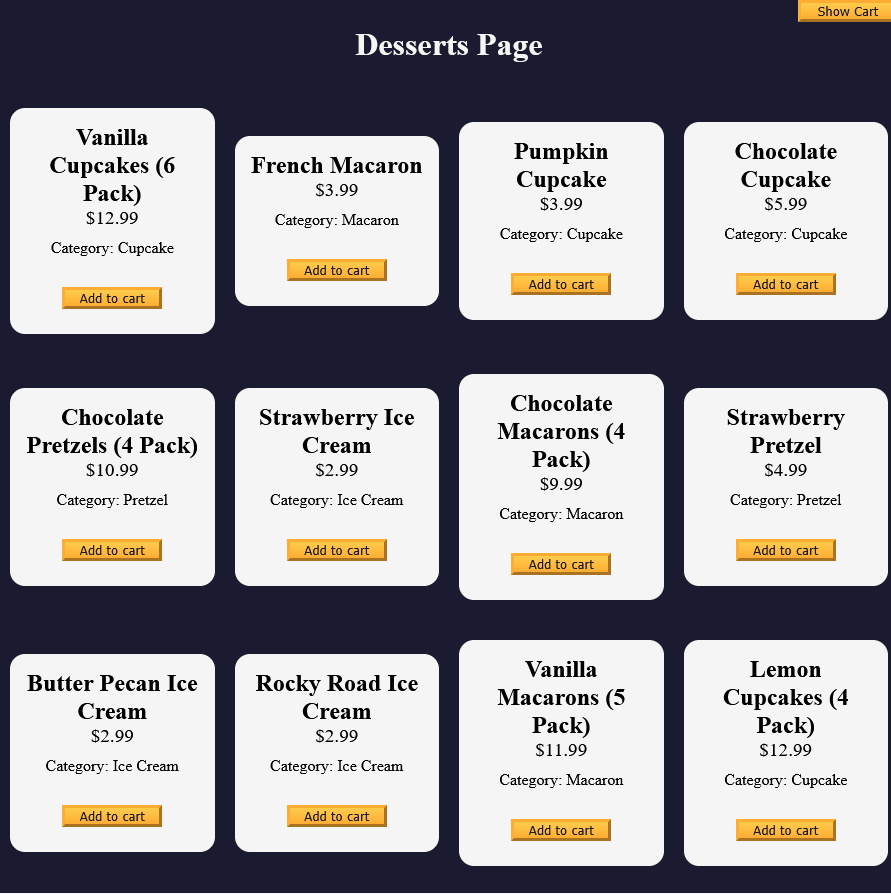
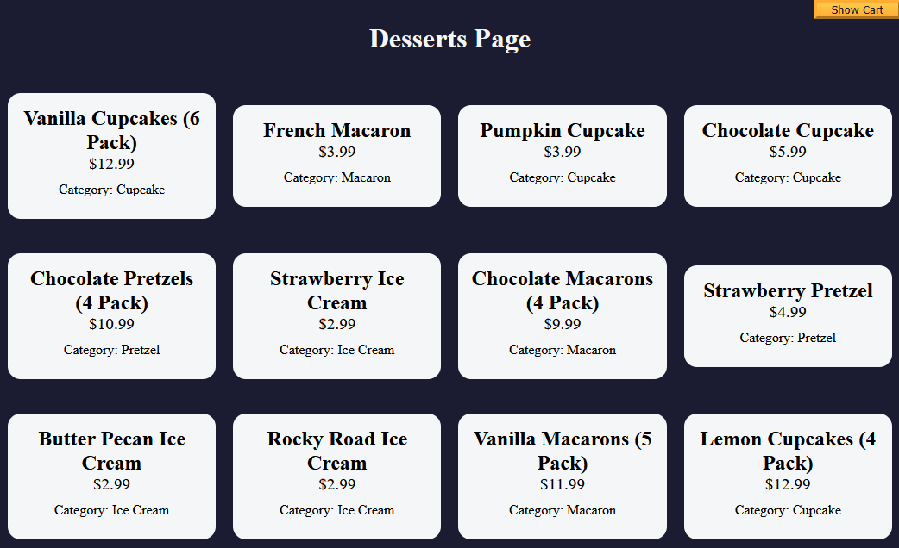
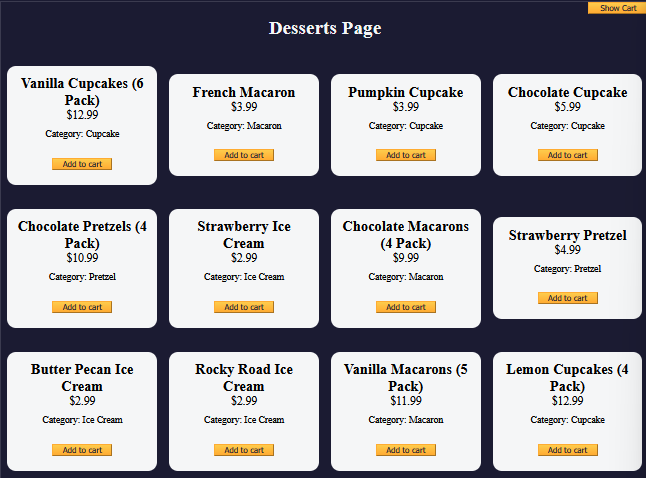

# 🧠 4A Learn Basic OOP by Building a Shopping Cart
* In this project, I will be building a shopping cart application using JavaScript

## 👨‍🍳 Final Product 👨‍🍳
* You can try out the application I built in this tutorial via this [link]()
* Here is a demo:
   
   

## 📝 Summary Notes 📝
* You can create classes in JavaScript in a similar way to Java but using the `class` keyword
```js
class Computer {}
```

## 🛠️ Project Setup 🛠️

* I have been provided the [HTML](code/index.html) and [CSS](code/styles.css)
* This is what the page looks like:
   <details>

   
   </details>

## 🟥 Initialising Variables

* I initialise my JavaScript with three variables pointed to the containers:
```js
const cartContainer = document.getElementById("cart-container")
const productsContainer = document.getElementById("products-container")
const dessertCards = document.getElementById("dessert-card-container")
```
* I intialise variable for buttons:
```js
const cartBtn = document.getElementById("cart-btn");
const clearCartBtn = document.getElementById("clear-cart-btn");
```
* I create variables for the total items, subtotal, taxes and total:
```js
const totalNumberOfItems = document.getElementById("total-items");
const cartSubTotal = document.getElementById("subtotal");
const cartTaxes = document.getElementById("taxes");
const cartTotal = document.getElementById("total");
```
* I create a variable for the `#show-hide-cart` element:
```js
const showHideCartSpan = document.getElementById("show-hide-cart");
```

* I create a variable to store whether cart is showing or not, I initialise it to false:
```js
let isCartShowing = false
```

## 🟥 Rendering Products

* I intiialise a `products` array with objects with keys: `id`, `name`, `price` and `category`:

   <details>

   ```js
   const products = [
   {
      id: 1,
      name: "Vanilla Cupcakes (6 Pack)",
      price: 12.99,
      category: "Cupcake",
   },
   {
      id: 2,
      name: "French Macaron",
      price: 3.99,
      category: "Macaron",
   },
   {
      id: 3,
      name: "Pumpkin Cupcake",
      price: 3.99,
      category: "Cupcake",
   },
   {
      id: 4,
      name: "Chocolate Cupcake",
      price: 5.99,
      category: "Cupcake",
   },
   {
      id: 5,
      name: "Chocolate Pretzels (4 Pack)",
      price: 10.99,
      category: "Pretzel",
   },
   {
      id: 6,
      name: "Strawberry Ice Cream",
      price: 2.99,
      category: "Ice Cream",
   },
   {
      id: 7,
      name: "Chocolate Macarons (4 Pack)",
      price: 9.99,
      category: "Macaron",
   },
   {
      id: 8,
      name: "Strawberry Pretzel",
      price: 4.99,
      category: "Pretzel",
   },
   {
      id: 9,
      name: "Butter Pecan Ice Cream",
      price: 2.99,
      category: "Ice Cream",
   },
   {
      id: 10,
      name: "Rocky Road Ice Cream",
      price: 2.99,
      category: "Ice Cream",
   },
   {
      id: 11,
      name: "Vanilla Macarons (5 Pack)",
      price: 11.99,
      category: "Macaron",
   },
   {
      id: 12,
      name: "Lemon Cupcakes (4 Pack)",
      price: 12.99,
      category: "Cupcake",
   },

   ];
   ```

   </details>

* I will now use JavaScript to display the products in the HTML. I use a for each loop, and object destructuring for the parameter of the forEach:
```js
products.forEach(
  ({ name, id, price, category }) => {

  }
);
```
* I append a `<div>` element which has a `<h2>` of the `name` of the product to the innerHTML of `dessertCards`:
```js
products.forEach(
   ({ name, id, price, category }) => {
      dessertCards.innerHTML += `
         <div class="dessert-card"><h2>${name}</h2></div>
      `;
   }
);
```
* I add two `<p>` elements after the div to render the price and category:
```js
products.forEach(
  ({ name, id, price, category }) => {
    dessertCards.innerHTML += `
      <div class="dessert-card">
        <h2>${name}</h2>
        <p class="dessert-price">\$${price}</p>
        <p class="product-category">Category: ${category}</p>
      </div>
    `;
  }
);
```
* This is what the dessert page looks like right now:

   

* I add a `Add to cart` button after the second `<p>` element:
```js
products.forEach(
  ({ name, id, price, category }) => {
    dessertCards.innerHTML += `
      <div class="dessert-card">
        <h2>${name}</h2>
        <p class="dessert-price">\$${price}</p>
        <p class="product-category">Category: ${category}</p>
        <button id="${id}" class="add-to-cart-btn">Add to cart</button>
      </div>
    `;
  }
);
```

* This is what the page looks like right now:


   


## 🟥 JavaScript Class
* You can create classes in JavaScript in a similar way to Java but using the `class` keyword
```js
class Computer {}
```
* I create a class to represent my shopping cart:
```js
class ShoppingCart {

};
```
* Classes have a special method for constructing the class called `constructor` - this is used to initialise variables.
* I add an empty constructor method to my `ShoppingCart`:
```js
class ShoppingCart {
   constructor() {}
};
```
* Within the constructor, you can use the `this` keyword to set the values of the fields of an object. I intialise the `total` to zero and `taxRate` to 8.25:
```js
class ShoppingCart {
   constructor() {
      this.items = []
      this.total = 0;
      this.taxRate = 8.25
   }
};
```
* I add an `addItem()` method to my class:
```js
class ShoppingCart {
   // constructor

   addItem(id, products) {

   }
}
```
* I use the `id` parameter, to find the product with matching id in the products array:
```js
addItem(id, products) {
   const product = products.find((item) => item.id === id);
}
```
* I destructure the `name` and `price` properties:
```js
addItem(id, products) {
   const product = products.find((item) => item.id === id);
   const {name, price} = product
}
```
* I add the `product` to the `items` field of the ShoppingCart class:
```js
addItem(id, products) {
   const product = products.find((item) => item.id === id);
   const { name, price } = product;
   this.items.push(product)
}
```
* I need to have a count of each product in my cart, so I intiialise a counter object and loop through the `items` of my array:
```js
addItem(id, products) {
   const product = products.find((item) => item.id === id);
   const { name, price } = product;
   this.items.push(product);

   const totalCountPerProduct = {};
   this.items.forEach((dessert) => {
   
   })
}
```
## 🟥 Using OR Operator to Initialise Value
* In my `totalCountPerProduct` variable, I want to store the `id` of the dessert as the key, and the count as the value
* If totalCountPerProduct doesn't have the id of the dessert already stored, I want to initialise the count as 0
* A common way to address this issue is to use the `||` operator, in my forEach loop I apply this pattern:
```js
this.items.forEach((dessert) => {
   totalCountPerProduct[dessert.id] = totalCountPerProduct[dessert.id] || 0
})
```
* I want to the value to be incremented by 1 when a dessert.id is looped, so I increment the RHS by 1:
```js
this.items.forEach((dessert) => {
   totalCountPerProduct[dessert.id] = (totalCountPerProduct[dessert.id] || 0) + 1;
})
```

* I need to update the count in the frontend, the HTML for this does not exist yet, but when it is there will be a span with an id of `product-count-for-id${product.id}` for each product in cart
* I declare a variable to store the updated count of the product of the item being added, and one for the span for the count in the UI:
```js
addItem(id, products) {
   // EXISTING CODE HERE
   const currentProductCount = totalCountPerProduct[product.id];
   const currentProductCountSpan = document.getElementById(`product-count-for-id${product.id}`)
}
```


### ⭐ H3 ⭐
